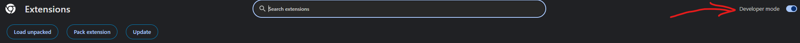
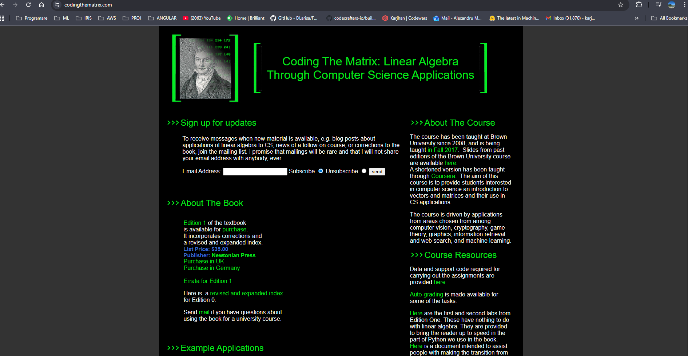
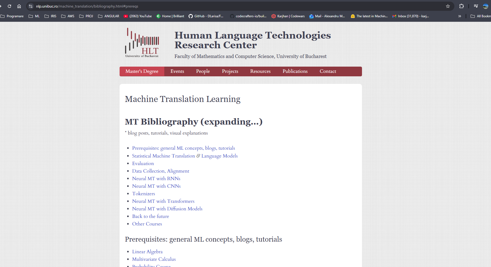
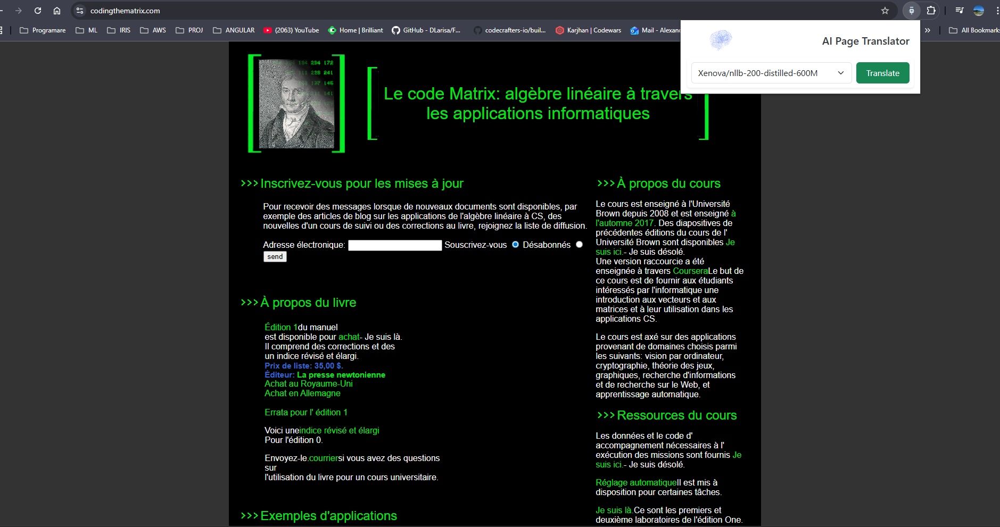
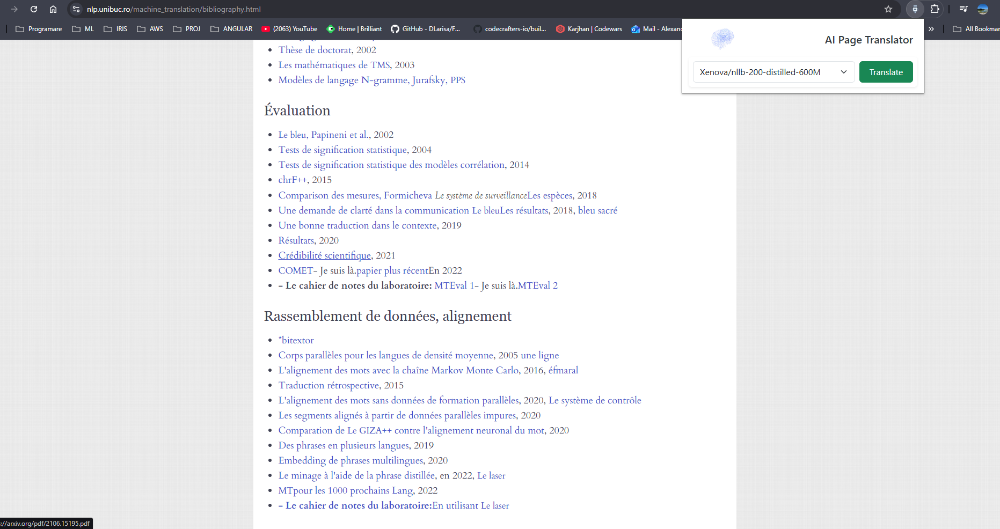
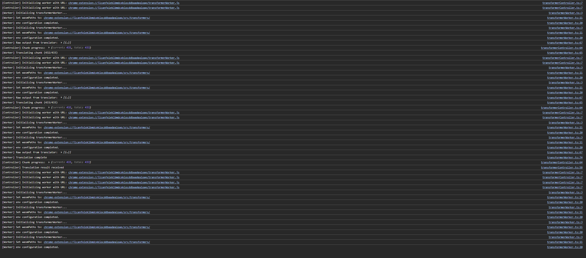

# MachineTranslation-BrowerTranslationPlugin

## Description
This is the project for Machine Translation class. They already had an existing NLLB (no language left behind)
model trained to translate from and to Aromanian. The task included to:
1. Distill the model 
2. Test different quantizations
3. Make the model run on device
4. Make a browser plugin to translate pages

## Technologies
The stack used:
- CRXJS (small framework that uses React + Vite to bundle beautifully into browser plugins)
- Transformer.JS (actual framework to embed models on device using ONNX runtime)
- React Bootstrap (for small styling, but could use something different)

The methodology was to try experimenting with an available NLLB model with already support for Transformer.JS and 
this was the only one available: [Xenova/nllb-200-distilled-600M](https://huggingface.co/Xenova/nllb-200-distilled-600M),
which is based on the popular [facebook/nllb-200-distilled-600M](https://huggingface.co/facebook/nllb-200-distilled-600M).

Only then I started with the actual model: [aronlp/NLLB-rup-ron-eng-ct2](https://huggingface.co/aronlp/NLLB-rup-ron-eng-ct2).

## Tips
1. Use [web workers](https://developer.mozilla.org/en-US/docs/Web/API/Web_Workers_API/Using_web_workers). They were a new concept to me, but it's the basic tool to run background tasks in browser, actually opening up OS threads, to not block the main process running the page.
2. Use a single worker -> more workers is generally a bad idea, since you have to copy the model in each of them -> memory and cpu consumption explode and you're dependent on the user's hardware, not a dedicated server
3. Use a controller/orchestrator for the worker, to better organize it and also treat it as a singleton (not to construct and deconstruct it every time the plugin is active for every request). In my case I have : `transformerWorker.ts` and `transformerController.ts`
4. Because of plugin security issues in the browser, you can't use `fetch` api on every domain, and so, you have to pre-load the model before hand. Keep the same folder structure and put it in the `public` folder, so that when the app is built, it will appear in the `dist` folder. That applies to the onnx utilities used in Transformer.JS as well. You will have to configure your worker and environment variables accordingly. Here is an example from `transformerWorker.ts`
```js
if (env?.backends?.onnx?.wasm) {
  const bundledPath = typeof chrome !== 'undefined' && chrome.runtime?.getURL
    ? chrome.runtime.getURL('transformers/')
    : new URL('../transformers/', self.location.href).toString();
  env.backends.onnx.wasm.wasmPaths = bundledPath;
} else {
  console.warn('Could not configure wasmPaths: wasm backend missing?');
}

env.allowLocalModels = true;
env.allowRemoteModels = false;
env.useBrowserCache = false;
env.localModelPath = '/models';
```
5. Update `manifest.config.ts` and `vite.config.ts` to allow access to these public resources. Just exposing them like in step 4 is not enough. By default, plugins don't have free access to every public resource unless specified. Check the files in the code

## File structure
There are 2 main folders:
1. `TransformerJS-PoC` - React + Vite Single SPA web app that I played around with Transformer.JS
2. `ChromeExtension-PoC` - Holds the actual logic for the browser plugin

## Installation
Until the plugin is deployed, this is the dev setup:
1. Clone the repository locally
2. Go into the browser plugin project directory:
```sh
cd ./ChromeExtension-PoC/chromeextension-poc
```
3. Run the `npm install` command (make sure to have npm installed locally for this):
```sh
npm install
```
4. Create `models` directory under `public` and populate it with the 2 hardcoded options (have to download them):
```sh
mkdir -p public/models/aronlp/NLLB-rup-ron-eng-ct2 public/models/Xenova/nllb-200-distilled-600M
```
5. Run the following command to start the project which will build the `dist` folder:
```sh
npm run dev
```
6. Go into browser -> `Manage Extension` tab -> toggle `Developer Mode` if any. Example in Chrome:

7. Click `Load unpacked` and select the `dist` folder in the project when window popup
8. Now you can test the plugin

## Visuals
### Original page


### After translation to french



## Additional Notes
- For now, I had to hardcode the `target` and `source` languages, but in the future, this can be automated.
- If you want to add more models (provided they are compatible with Transformer.JS and are small enough), add them under `./public/models` and keep the original folder structure of the model
- If you want to deploy to chrome web store, just zip the `dist` folder
- It's super slow for now, unfortunately. Even batching the chunks is not increasing the performance by too much and webgpu is not an option for all + depends on quantization.


